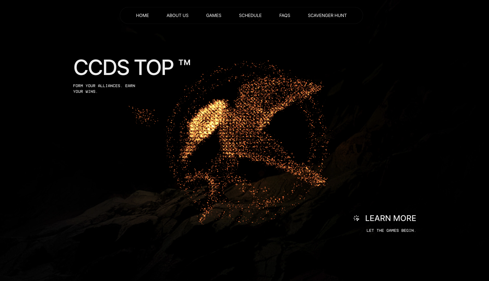
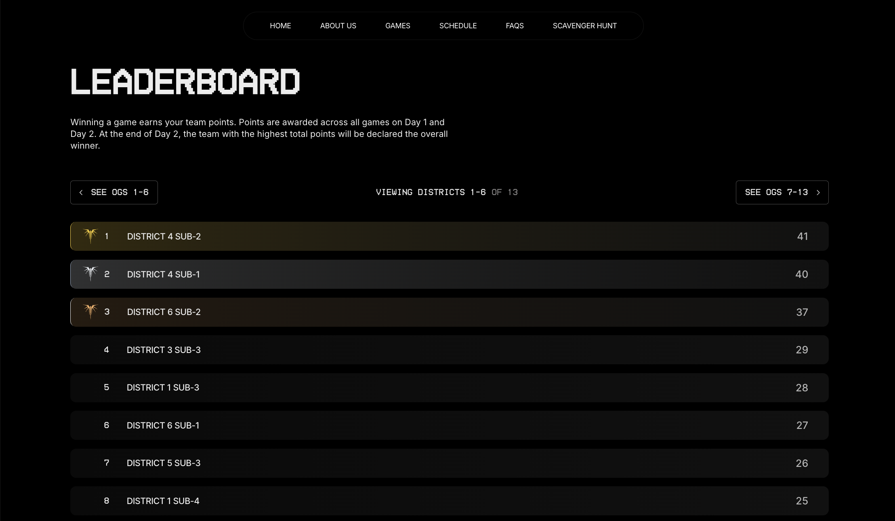
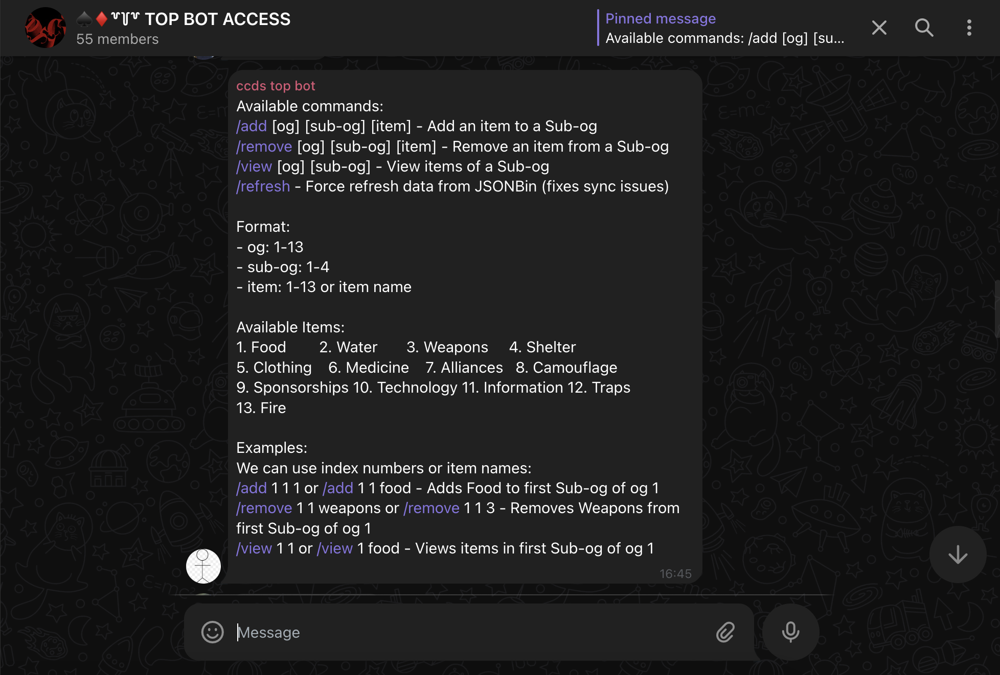

# CCDS 2025 Orientation Website

## Overview
A website + telegram management system used for managing and displaying realtime leaderboard and activities for NTU CCDS 2025 Orientation. The system supported the orientation event reliably for 40+ GLs managing OG activities.

## Features

<table>
<tr>
<td align="center"><strong>Home Page</strong></td>
<td align="center"><strong>Real-time Leaderboard</strong></td>
<td align="center"><strong>Management via Telegram</strong></td>
</tr>
<tr>
<td></td>
<td></td>
<td></td>
</tr>
</table>

---

## Tech Stack

- **Framework:** Next.js (React)
- **Backend:** Next.js API Routes
- **Database:** JSONBin.io API
- **Bot:** grammY framework (via Telegram Webhooks)
- **Deployment:** Vercel

---

## Getting Started

### Prerequisites
- **Node.js** 
- **Git** 

### Installing Dependencies

1. Clone the repository to your local machine:

   ```bash
   git clone https://github.com/CCDS-TOP/TOP-2025-Website.git
   ```

2. Navigate to the project directory:

   ```bash
   cd TOP-2025-Website
   ```

3. Install dependencies:

   ```bash
   npm install
   # or
   yarn install
   ```

4. To start the development server, run:
    ```bash
    npm run dev
    # or
    yarn dev
    ```